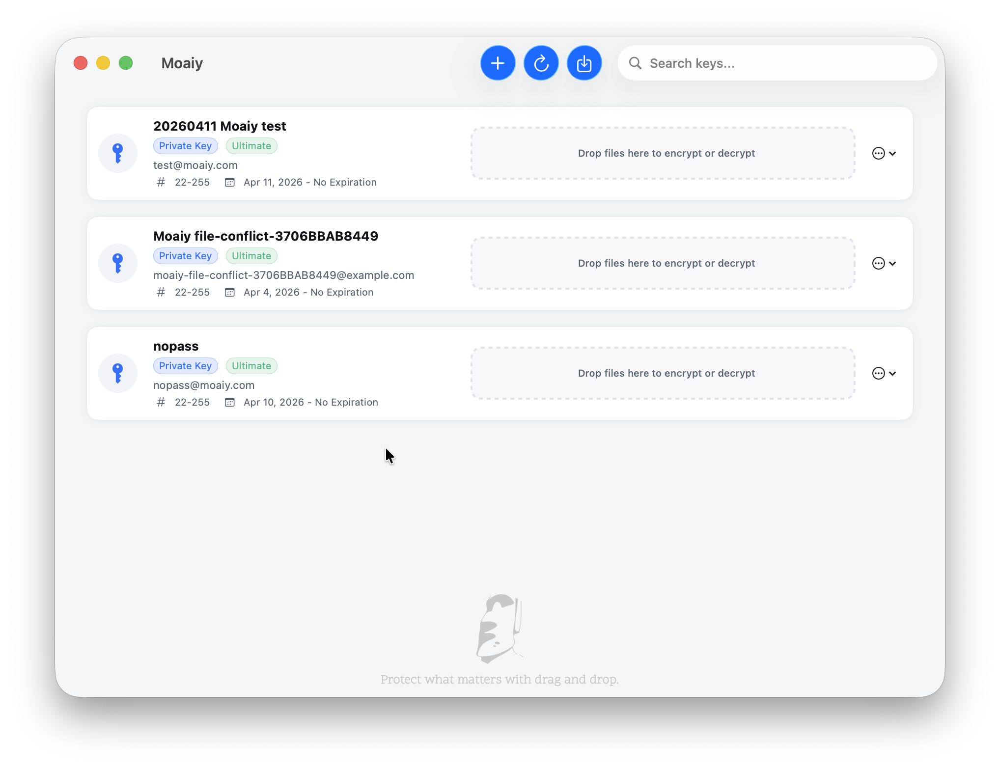

# Moaiy

> Protect what matters with drag and drop.

Moaiy helps you protect your important information through simple, easy actions.

Moaiy is an open-source macOS app for encryption and recovery workflows, designed with a native SwiftUI experience.

**[Chinese Version](./README_CN.md)**

Latest stable release: `v0.9.0`
Current rollout: Kyber-768 hybrid post-quantum encryption support

## App Screenshot



## What's New in v0.9.0

Moaiy v0.9.0 adds Kyber-768 hybrid OpenPGP support for users who want a post-quantum-ready encryption path while keeping familiar GPG workflows.

- Added Kyber-768 hybrid key generation through the bundled GnuPG runtime.
- Updated the embedded `gpg.bundle` to GnuPG 2.5.21 with Kyber public-key support.
- Added automatic post-quantum capability detection, key classification, and UI badges for PQC keys.
- Added text and file encryption/decryption coverage for Kyber-backed keys.
- Added backup, restore, migration, and interoperability validation for post-quantum keys.
- Added Pro/team policy safeguards so Kyber defaults are only applied when the active GPG runtime supports them.
- Added release compatibility notes: Kyber-768 hybrid keys require GnuPG 2.5.21+ or compatible OpenPGP implementations; use RSA-4096 when sharing with older tools.
- Fixed app icon packaging so generated DMGs include the correct `moaiy_icon.icns` resource.

## Features

- Generate, import, export, and delete keys
- Encrypt and decrypt text
- Encrypt and decrypt files
- Generate and use Kyber-768 hybrid OpenPGP keys
- Trust management, key signing, and key editing flows
- Backup and restore workflows
- Bundled GPG runtime support for sandboxed app environments

## Requirements

- macOS 14.0+ (app runtime)
- Xcode with macOS 14 SDK support (recent stable release)

## Quick Start

### Option 1: Download Release

- Download the latest `.dmg` from [GitHub Releases](https://github.com/moaiy-com/moaiy/releases)
- Apple Silicon Macs: `Moaiy-0.9.0-macos-apple-silicon.dmg`
- Intel Macs: `Moaiy-0.9.0-macos-intel-chip.dmg`

### Option 2: Build from Source

```bash
git clone https://github.com/moaiy-com/moaiy.git
cd moaiy
open Moaiy/Moaiy.xcodeproj
```

Or build via CLI:

```bash
xcodebuild -project Moaiy/Moaiy.xcodeproj \
           -scheme Moaiy \
           -destination 'platform=macOS' \
           build
```

## Package DMG

Use one command to build and package a timestamped DMG:

```bash
./scripts/package_dmg.sh
```

Useful options:

```bash
./scripts/package_dmg.sh --configuration Release
./scripts/package_dmg.sh --skip-build --open
```

This script is intended to be run in your local terminal. Running it locally avoids repeated sandbox escalation prompts in AI sessions.

## Run Tests

```bash
xcodebuild test -project Moaiy/Moaiy.xcodeproj \
                -scheme Moaiy \
                -destination 'platform=macOS'
```

## Bundled GPG Workflow

If you need to refresh the embedded GPG bundle:

```bash
./scripts/prepare_gpg_bundle.sh
./scripts/verify_gpg_bundle.sh
```

If the bundle is not added in Xcode, use:

```bash
./scripts/add_gpg_bundle_to_xcode.sh
```

## Repository Layout

```text
moaiy/
├── Moaiy/                  # Main macOS app
├── MoaiySandboxTest/       # Sandbox validation app/project
├── scripts/                # Build and packaging utilities
├── doc/                    # Technical documentation
├── CONTRIBUTING.md
├── DISCLAIMER.md
├── README_CN.md
└── LICENSE
```

## Documentation

- [Contributing Guide](./CONTRIBUTING.md)
- [Documentation Index](./doc/README.md)
- [Release Workflow Guide](./doc/release-workflow-skill.md)
- [Technical Architecture](./doc/technical-architecture.md)
- [Technical Validation Status](./doc/technical-validation-status.md)
- [Xcode Integration Guide](./doc/xcode-integration-guide.md)
- [Bundled GPG Summary](./doc/bundled-gpg-summary.md)
- [Changelog](./CHANGELOG.md)

## Localization

- UI: English, Chinese (Simplified), Spanish, Portuguese (Brazil), Hindi, Arabic, French, German, Japanese, Korean, Russian
- String catalog: `Moaiy/Resources/Localizable.xcstrings`

## Security

If you discover a security issue, use private disclosure channels described in
[SECURITY.md](./SECURITY.md) instead of filing a public issue.

## License

MIT. See [LICENSE](./LICENSE).

## Disclaimer

For key-management, key-leakage, information-exposure, and financial-loss risk boundaries, see [DISCLAIMER.md](./DISCLAIMER.md).
