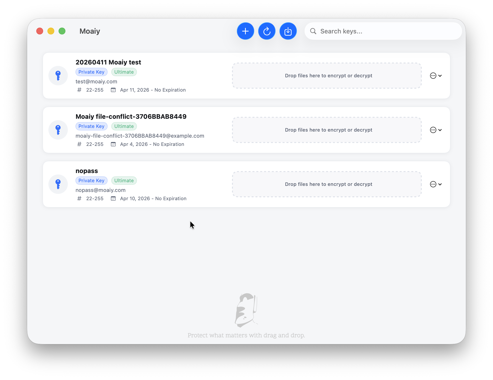

# Moaiy

> 通过拖放，保护你最重要的信息。

Moaiy 帮你通过简单、易操作的步骤保护重要信息。

Moaiy 是一个开源的 macOS 原生应用，专注于加密与恢复工作流，使用 SwiftUI 构建。

**[English Version](./README.md)**

当前稳定版本：`v0.8.0`  
当前进行中的迭代：`v0.8.1`

## 应用截图



## 功能特性

- 生成、导入、导出和删除密钥
- 文本加密与解密
- 文件加密与解密
- 信任管理、密钥签名与密钥编辑流程
- 备份与恢复流程
- 支持在沙盒环境中使用内置 GPG 运行时

## 环境要求

- macOS 14.0+（应用运行环境）
- 支持 macOS 14 SDK 的 Xcode（建议使用最新稳定版）

## 快速开始

### 方式 1：下载发布版本

- 从 [GitHub Releases](https://github.com/moaiy-com/moaiy/releases) 下载最新 `.dmg`

### 方式 2：源码构建

```bash
git clone https://github.com/moaiy-com/moaiy.git
cd moaiy
open Moaiy/Moaiy.xcodeproj
```

或使用命令行构建：

```bash
xcodebuild -project Moaiy/Moaiy.xcodeproj \
           -scheme Moaiy \
           -destination 'platform=macOS' \
           build
```

## DMG 打包

使用一条命令完成构建并生成带时间戳的 DMG：

```bash
./scripts/package_dmg.sh
```

常用参数：

```bash
./scripts/package_dmg.sh --configuration Release
./scripts/package_dmg.sh --skip-build --open
```

建议在本机终端直接执行该脚本，这样可避免在 AI 会话中反复触发沙盒提权提示。

## 运行测试

```bash
xcodebuild test -project Moaiy/Moaiy.xcodeproj \
                -scheme Moaiy \
                -destination 'platform=macOS'
```

## 内置 GPG 工作流

如果需要刷新内置 GPG bundle，可执行：

```bash
./scripts/prepare_gpg_bundle.sh
./scripts/verify_gpg_bundle.sh
```

如果尚未将 bundle 添加到 Xcode，可执行：

```bash
./scripts/add_gpg_bundle_to_xcode.sh
```

## 仓库结构

```text
moaiy/
├── Moaiy/                  # 主 macOS 应用
├── MoaiySandboxTest/       # 沙盒验证项目
├── scripts/                # 构建与打包工具
├── doc/                    # 技术文档
├── CONTRIBUTING.md
├── DISCLAIMER.md
├── README_CN.md
└── LICENSE
```

## 文档

- [贡献指南](./CONTRIBUTING.md)
- [文档索引](./doc/README.md)
- [发布流程说明](./doc/release-workflow-skill.md)
- [技术架构](./doc/technical-architecture.md)
- [技术验证状态](./doc/technical-validation-status.md)
- [Xcode 集成指南](./doc/xcode-integration-guide.md)
- [内置 GPG 概览](./doc/bundled-gpg-summary.md)
- [更新日志](./CHANGELOG.md)

## 本地化

- UI 语言：English、简体中文、西班牙语、葡萄牙语（巴西）、印地语、阿拉伯语、法语、德语、日语、韩语、俄语
- 字符串资源：`Moaiy/Resources/Localizable.xcstrings`

## 安全

如果发现安全问题，请优先使用 [SECURITY.md](./SECURITY.md) 中说明的私下披露渠道，而不是公开提交 Issue。

## 许可证

MIT，详见 [LICENSE](./LICENSE)。

## 免责声明

关于密钥管理、密钥泄漏、信息暴露与财产损失等风险边界，请查看 [DISCLAIMER.md](./DISCLAIMER.md)。
